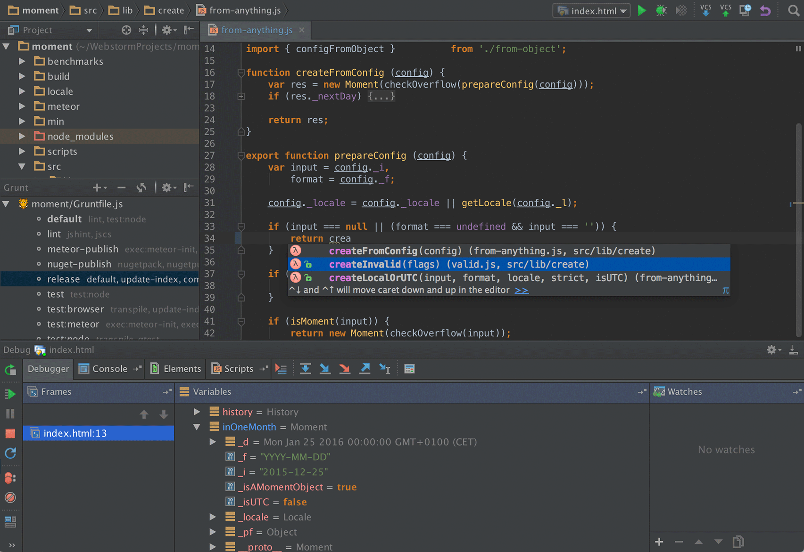

# 官网

WebStorm：[http://www.jetbrains.com/webstorm/](http://www.jetbrains.com/webstorm/)

PhpStorm：[http://www.jetbrains.com/phpstorm/](http://www.jetbrains.com/phpstorm/)

付费软件，国内有破解，土豪请无视

# web(php)storm 时下流行库支持友好

> * 对 [git](http://baike.baidu.com/link?url=c-Bfn2X0hFmUBJ44lS7Imrz-5EgMoPASiUgRbf4urNGeUNMCBZK1m5Rcawfb07AX7eTqHMsoe75MSMZzfZiM2q) 支持很赞（.gitignore）

> * 对 [Markdown](http://baike.baidu.com/link?url=SX1FnI_-aV_4t3g8kCxZLrPt-VVyEi0fbfWefSS-TrXx-fsQlzt1O6qlI-_INCA49hfi9MQouHc3sKwtg2pGyFTKquki6_jKKkQrrm6PcSS) 支持友好

> * 内置支持 [Zen Coding](http://baike.baidu.com/link?url=jmJYMuPtd4ETI9pWULKZ9-KDhVsoM2Uj8mhvfIfin_aB0wm2HW3Ff7sWwOTIxB3Ik8tKF2SZBnvFGw5ENRh6ZLHnyNjMbwcbgTQCkO0TIfW)（Emmet），比如：`div>ul>li*8>img[src=img/$.jpg]`

> * 除本身对nodejs、less、sass、typescript、coffeescript...支持友好，还可以自行添加插件

开发环境预览

# web(php)storm 常用快捷键

## 注释/解注

单行注释 `Ctrl + /`

多行注释 `Ctrl + Shift + /`

## 转到定义

光标指到方法上，按住 `Ctrl` + 鼠标单击，或者按 `Ctrl + B`

## 回到（向前、向后）原光标处

向后：`Ctrl + Alt + ←`

向前：`Ctrl + Alt + →`

## 搜索

全局搜索：`Ctrl + Shift + F`

当前搜索：`Ctrl + F`

## 替换

全局替换：`Ctrl + Shift + R`

当前替换：`Ctrl + R`

## 重构 

`Shift + F6`

## 查看某个方法被哪些地方调用
 
`Alt + F7`

## 打开一个已知文件
 
`Ctrl + Shift + N`

## 多行文本前后处理

按住 `Alt`

## 代码格式化

`Ctrl + Alt + L`

# 完

当使用正则表达式返回了想要的结果时程序员的样子