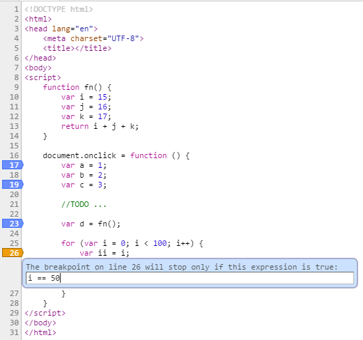
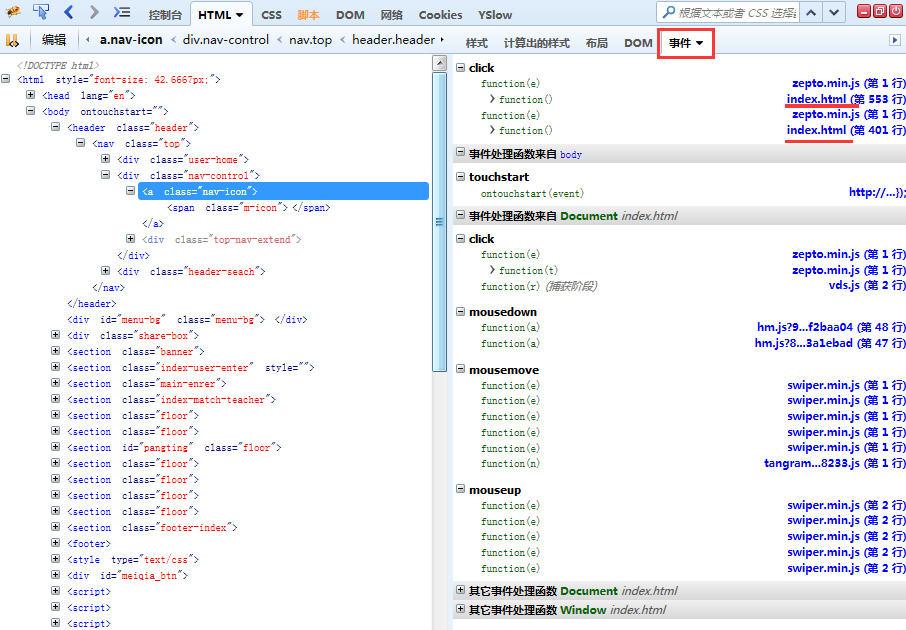

# 调试技巧（主要针对Chrome和Firefox）

## 快捷键

逐断点执行：`F8`

逐句执行，不进入函数：`F10`

逐句执行，进入函数：`F11`

打开文件：`Ctrl + O`

```
function fn() {
    var i = 15;
    var j = 16;
    var k = 17;
    return i + j + k;
}

document.onclick = function () {
    var a = 1;
    var b = 2;
    var c = 3;
    
    // TODO ...
    
    var d = fn();
    for (var i = 0; i < 100; i++) {
        var ii = i;
    }
}
```



## 选择神器 $ 和 $$

即使我们页面没有引用jQuery（Zepto）,你也依然可以使用 `$` 和 `$$` 函数来选取元素，其实这两个函数本质就是：**document.querySelector()** 和 **document.querySelectorAll()** 的简单封装

## 查看元素上绑定了哪些事件

极力推荐Firefox，之前尝试过Chrome DevTools Event Listeners和安装[Visual Event](https://chrome.google.com/webstore/detail/visual-event/pbmmieigblcbldgdokdjpioljjninaim?utm_source=chrome-app-launcher-info-dialog)插件，但其结果并不满意。



另外在js报错描述上，Firefox也比Chrome更加精准。


 


